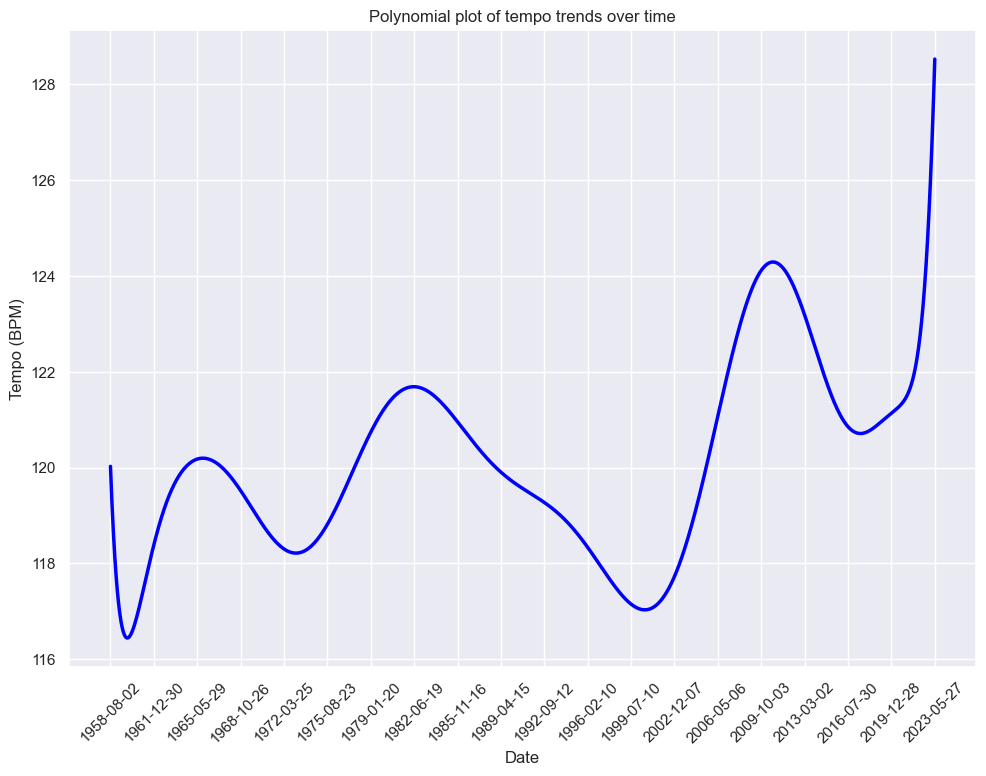
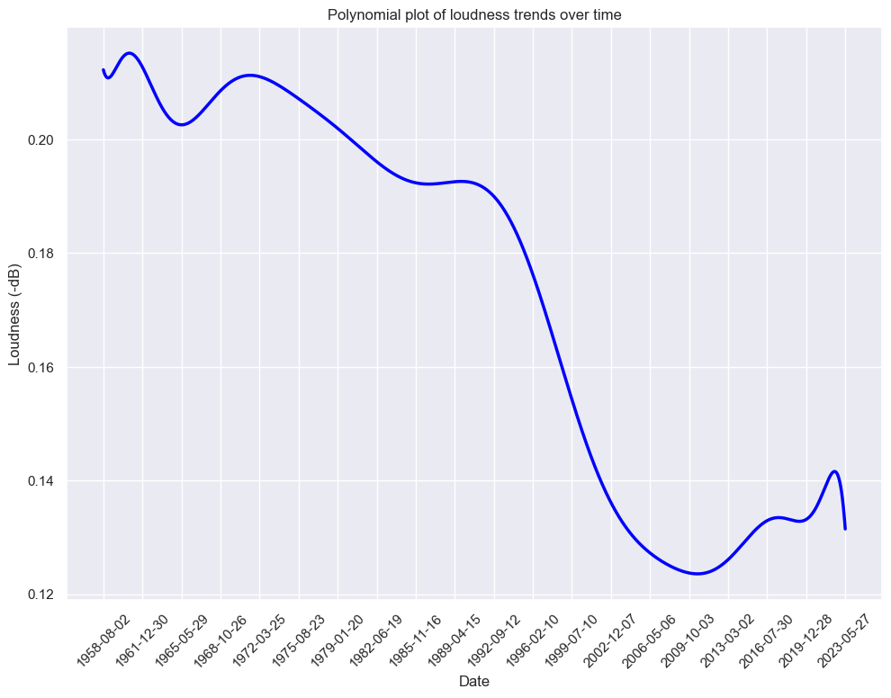
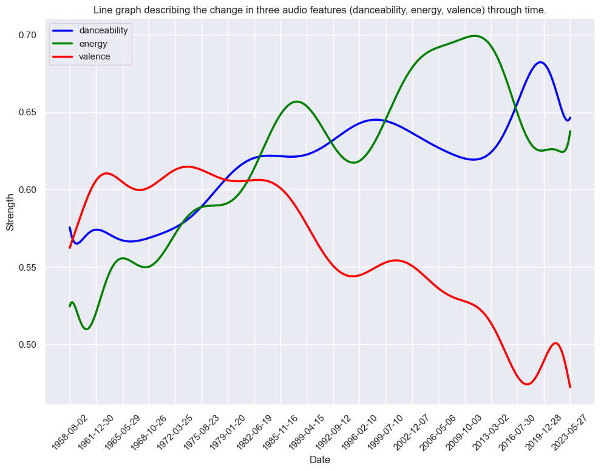
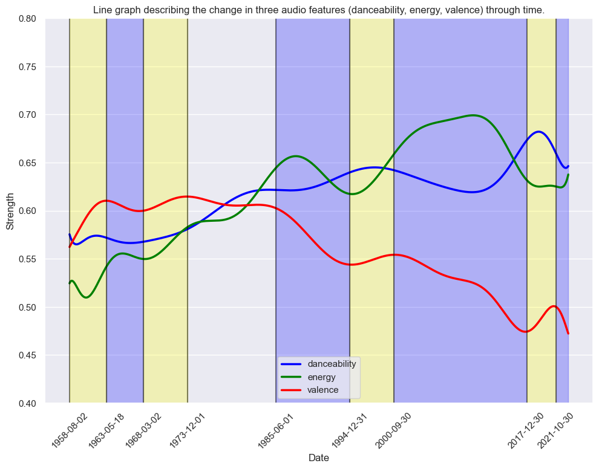

# Billboard Music Trend Analysis
People often listen to the music that resonates with their mood, so is the inverse conclusion remain correct? Does current affair affect what kind of music people listen to. If so, can we use music trends as an accurate predictor of societal changes.
# Prerequisites
* [Billboard hot 100 since 1958 to 2023](https://github.com/HipsterVizNinja/random-data)
* [Spotify API](https://developer.spotify.com/documentation/web-api)
* [Billboard charts](https://www.billboard.com/charts/)
* Spotify API stored under spotify_secret.json as strings with two keys: "ID", "Key"
```
{
    "ID": "abcd...",
    "Key": "abcd..."
}
```
# Working with data
My process of working with data includes:
1. Cleaning data from the Billboard database.
2. Collecting audio features from the names listed in Billboard database.
3. Merging collected audio features into a new dataframe.
4. Cleaning new dataframe.
5. Plotting dataframe.
6. Analysing dataframe.
The full process and explanation can be viewed [here](main.ipynb)
# Analysis


*Music duration trends*



*Music tempo trends*



*Music loudness trends*



*Music audio features trends*



*Music audio features with highlight in positivity/negativity trends*
## Trends
* Valence goes down
* Danceability & Energy go up
* Tempo rises
* Loudness, duration go down
## Suggested Questions
* Does the music people often listen reflective of the current affairs in the US?
* Why does valence decrease over time?
* Why do danceability and energy increase over time?
* Why after a decrease in valence, it doesn't come back up nearly as strong as before?

## Events
* 1945 - 1964: Post-war economic growth.
* 1964 - 1973: Begin to protest - American retreat (Vietnam War).
* 1981 - 1982: US Recession.

This graph demonstrated that music does mirror what happens in the US society to a certain degree as it does align with the possitivity/negativity perceived from historic events during these time frames. It makes sense as people often listen to songs that resonate the most to their mood.

In the late 1990s and early 2000s, we can also infer some information from the graphs shown:
* The average duration of songs tend to decrease.
* The Tempo (BPM) tends to rise.
* Loudness (-dB) dropped significantly.

That means people tend to listen to songs that are quieter, shorter, and more fast-paced. Coincidentally, these features, in tandem with the valence above, seem to change dramatically in the same timeframe (from 1990 to around early 2000s), which might be caused by, but not restricted to, the advent of the internet and its applications like social media and streaming services, a change in general etiquette, or advancements in audio recording techniques.